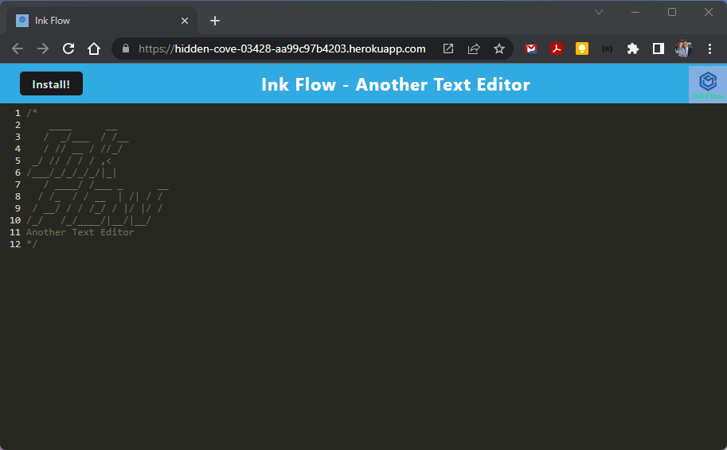
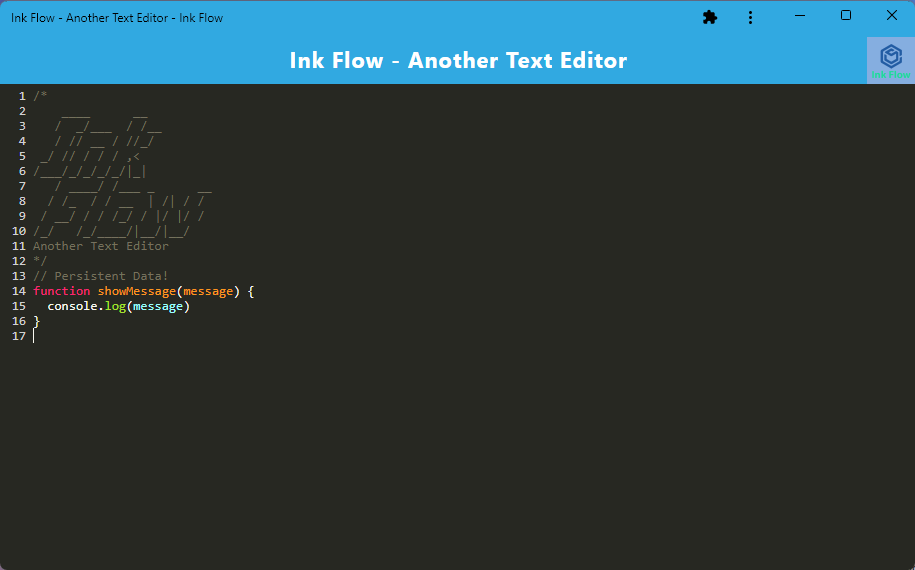

# Ink Flow - Another Text Editor

 [](https://opensource.org/licenses/MIT)

A progressive web application for editing text in the browser, utilising the CodeMirror library.

## Description

This is a simple text/code editor that allows you to edit in the browser. It is a single page, progressive web application (PWA). It can be installed on your device and used offline. It uses the CodeMirror library for editing, and Webpack to bundle the application, using service workers in the browser. It takes advantage of the IndexedDB API to store files and data locally.

## Table of Contents

- [Technologies Used](#technologies-used)
- [Installation](#installation)
- [Usage](#usage)
- [Live Application](#live-application)
- [Credits](#credits)
- [License](#license)
- [Contributing](#contributing)
- [Questions](#questions)

## Technologies Used

- [JavaScript](https://developer.mozilla.org/en-US/docs/Web/JavaScript)
- [Node.js](https://nodejs.org/en/)
- [Express.js](https://expressjs.com/)
- [Webpack](https://webpack.js.org/)
  - Service Workers
  - Web Manifest
- [IndexedDB](https://developer.mozilla.org/en-US/docs/Web/API/IndexedDB_API)
- [Node.js](https://nodejs.org/en/)
- [Express](https://expressjs.com/)
- [Babel](https://babeljs.io/)
- [CodeMirror](https://codemirror.net/)
  
## Installation
  
Fork or copy the repository to your own machine. To install the necessary dependencies, run the following command in the terminal:
  
```bash
npm i
```

To install dependencies for the client and the server, run the following command in the terminal:

```bash
npm run install
```

To build the application, run the following command in the terminal:

```bash
npm run build
```

To start the server, run the following command in the terminal:

```bash
npm run server
```

To rebuild the client and start the server, run the following command in the terminal:

```bash
npm run start
```

## Usage

Navigate to [http://localhost:3000](http://localhost:3001) in your browser to view the application.

Start entering your text! You can test it online and offline. You can also install it on your device as a PWA by clicking the install button in the address bar.

### Screenshots

Initial screen in browser:


Screen when installed on device:


## Live Application

The application is deployed on Heroku [Ink Flow](https://hidden-cove-03428-aa99c97b4203.herokuapp.com/).

## Credits

Thanks to the brilliant minds who created the libraries that made this application possible. See the links in the [Technologies Used](#technologies-used) section above.

## License
  
This repository is licensed under the [MIT](https://opensource.org/licenses/MIT) license.
  
## Contributing
  
Contributions to this project will not be accepted, as this project is an assessment piece for a coding course, and it must be the project author's own work. However, feel free to fork the repository and make your own changes.
  
## Questions
  
If you have any questions about the repository, open an issue or contact me directly at:
[rene.malingre@gmail.com](mailto:rene.malingre@gmail.com).
  
You can find more of my work at [GitHub](https://github.com/ReneMalingre).
